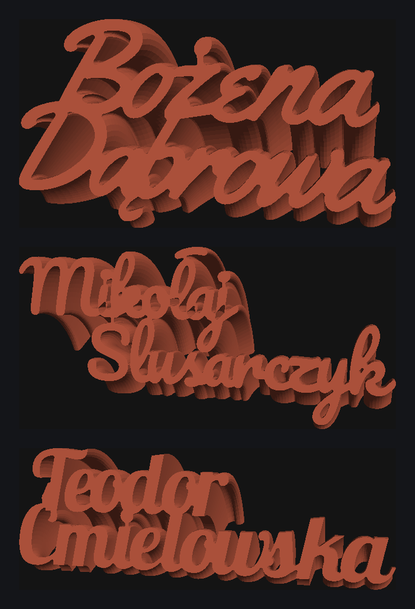

# NamR

**[mr4lexndr.github.io/NamR](https://mr4lexndr.github.io/NamR/)**



Turn a name — or a whole guest list — into 3D printable script name tags for
wedding tables, parties and desks. Type it, see it, download STL or 3MF.

The hard part is not drawing the letters, it is making them hold together.
Joined script is full of gaps: a capital that never quite reaches the next
letter, an i-tittle floating free, two lines that only touch if you nudge them
into each other. Left alone that prints as a heap of loose pieces. NamR closes
those gaps the way a signwriter would — tightening the spacing, sliding the
surname to where the two lines interlock, stemming each accent to its own
letter — and only bridges what is genuinely too far apart. Every tag comes out
as **one connected solid**: no supports, no glue, no assembly.

- **Batch the whole list.** Paste names or drop in a CSV, and every tag is
  packed onto printer beds and zipped up with a manifest, ready to slice.
- **Reads face-down on the glass**, so the visible side comes off smooth.
- **Polish and Latin Extended** throughout — ą ć ę ł ń ó ś ź ż keep their
  accents, joined to the letter they belong to.
- **Nine script faces bundled**, or load your own; it is parsed in the browser.
- **Nothing is uploaded.** No account, no server. It is a static site, so guest
  names never leave your machine.

## Status

| Stage | State |
|---|---|
| Font → outlines, Polish diacritics | done |
| Mark detection (tittles, accents) | done |
| Line overlap solve | done |
| Welding + bridging → one piece | done |
| Profile decimation | done |
| 3D mesh (60° revolve) | done |
| STL / 3MF export | done |
| Web UI + 3D preview | done |
| CSV bulk import | done |
| Bed packing / batches | done |
| Bridge editor | not started |

Validated on 17 Polish names across all nine faces (153 combinations): every
one resolves to a single watertight, correctly oriented component, held
together on at least two different pairs of letters. 108 need no strut at all.

Leaving the surname empty gives a one-line tag.

```
ok   Ryszard Jasiński           comp=1 br=3 56x32x30mm 41Ktri 1.95MB
ok   Łukasz Ćwikliński          comp=1 br=5 69x34x32mm 45Ktri 2.16MB
ok   Krzysztof Wojciechowski    comp=1 br=6 91x32x30mm 57Ktri 2.72MB
...
12/12 ok, 67ms/name
```

## The geometry, confirmed

A STEP export of the original CAD model settles it. Parsing that B-rep's 462
circles:

- every one shares a single axis, direction `(1,0,0)` — parallel to the baseline
- all centred on one line at `Y = -11.906, Z = 0`
- radii run `5.000` to `46.534`; the minimum is exactly the 5mm offset
- `max Z / max radius = 40.30 / 46.534 = sin 60°` exactly

So the tag is the merged profile **revolved 60° about an axis parallel to the
baseline, 5mm past the lowest ink**. The `R50.00` in `angle.png` is
construction geometry for the sweep path and never reaches the solid, which is
why it looked inconsistent with the 5mm offset: a sweep along an arc whose
centre lies in the profile plane *is* a revolve, so the path radius drops out.

The name reads off the `alpha = 0` face. `mode: 'extrude'` is kept as a flat
plate variant.

## Architecture

Pure client-side. Vite + TypeScript + React, Three.js preview, Web Worker pool
for the geometry so a large CSV never blocks the UI.

```
src/geom/
  types.ts      Pt / Ring / Poly, shoelace area (CCW positive)
  clipper.ts    WASM Clipper wrapper: union, offset, closing, erosion
  text.ts       font → tagged contours, Polish fallback, mark detection
  connect.ts    line overlap, mark stems, MST bridging
  simplify.ts   Douglas-Peucker decimation
  sweep.ts      profile → watertight mesh (60° revolve)
  export.ts     binary STL, 3MF, manifold check
  tag.ts        the whole pipeline for one tag
  csv.ts        guest list parsing, delimiter sniffing
  pack.ts       shelf packing onto printer beds
  batch.ts      many names -> plates -> zip + manifest
```

### How a tag is built

1. **Outlines.** opentype.js, with pair kerning. Missing Polish glyphs fall
   back to the base letter and are reported.
2. **Mark detection.** A glyph whose rings form more than one island — `i` and
   its tittle, `ń` and its acute — yields marks for every island but the
   largest. Provenance is kept per contour.
3. **Stems.** Each mark is tied to *its own* letter. Proximity alone would
   graft an `i` tittle onto whichever letter happens to be nearest, which on a
   tight script is often the wrong one.
4. **Tightening.** A script is meant to join up, so a gap between letters is
   closed by pulling them together rather than bridging across it — the result
   reads as handwriting instead of two letters wired together. Each letter may
   travel `letterTighten`; anything still apart is left to bridging. A shift is
   rejected if it pushes a letter into a neighbour's counter, and the finished
   word is compared against the untightened one, so it can never make things
   worse.
5. **Line placement.** Sliding the surname straight up is the wrong single
   degree of freedom: two lines of script interlock at particular horizontal
   offsets, where a descender drops into the gap between two ascenders. Depth
   has to be searched too — the shallowest overlap that welds is often not the
   one that reads best, and pushing the lines further into each other
   frequently removes a strut altogether.

   Placements are costed by the strut they would still need, as the minimum
   spanning tree over whatever islands remain. Counting welds alone accepts a
   position that welds twice and then strands a letter across half the tag,
   and the strut spanning that gap is the thing that looks wrong. What keeps
   deeper overlaps honest is the *mutual overlap area*: a weld costs a few
   square millimetres, two lines marching through each other cost hundreds,
   which is where the name stops being readable.

   A coarse sweep of both axes on heavily decimated outlines, then a local
   refinement at finer resolution. 117 of 135 test tags need no strut at all;
   the mean longest strut is 0.4mm. The two lines must still meet in at least
   two places, because one contact is a hinge that snaps.
6. **Closing.** Morphological closing (dilate then erode by `weldRadius`)
   welds gaps up to `2 × weldRadius` without fattening the letterforms.
7. **Bridging.** Islands that survive are joined by a minimum spanning tree
   over inter-island distance: n islands need exactly n−1 bridges, each placed
   where the letters already almost touch. A second pass runs after filleting,
   because two strokes meeting at a single point come back from the union as
   one self-touching ring and only fall apart once the pinch is resolved — a
   contact with no width was never a connection worth counting.
8. **Fillet and tidy.** A small closing rounds where connectors meet strokes,
   then trapped slivers are filled. A hole has to fail two tests before it
   goes. *Provenance:* a counter is enclosed by one glyph on its own, so an
   open bowl that welding seals still counts — Yellowtail's R is one, and
   judging by the raw outline alone filled it into a blob. *Size:* the gap
   between two adjacent letters belongs to neither of them, but it is the eye
   of the script, and filling it turns the word solid. Only a hole that is
   both foreign and tiny is an artifact.
9. **Decimate.** Douglas-Peucker at 0.02mm. Cuts points ~3× for 0.07% area
   error, and clears the slivers that make ear-clipping drop a triangle.
10. **Mesh.** Earcut caps plus a quad band per boundary edge. No 3D booleans.
   Checked watertight before export.

Every step above is editable by hand afterwards: any link can be removed or
dragged, and the surname can be repositioned directly, with the solver
respecting those choices on the next rebuild.

### Orbiting

The preview orbits in the readable face's own frame, not the world's. That
face is tilted by the sweep angle, so orbiting about world-up merely rolls the
name diagonally across the screen instead of walking around it — the writing
never sits level and there is no way to get a side view. Building the basis
from the face itself (baseline right, its own up, its normal out) makes a
horizontal drag mean "look from the side" and keeps the name level throughout.
Home is that face, a fraction off-axis so the depth reads.

### Print orientation

The face you read is the one at the far end of the sweep, whose normal is
`(0, -sin a, cos a)`. Exports rotate the tag by `180 - a` about X so that
normal becomes `-Z` and the readable face beds against the glass, coming off
with the smooth finish. The preview keeps the as-built pose, which reads
better on screen.

### Batches

A guest list goes in as CSV or pasted text. The delimiter is sniffed rather
than assumed — Polish Excel writes semicolons — the BOM is stripped, a header
row is detected if present, and a single-column file is split on the last
space so multi-part given names survive.

Tags are packed tallest-first onto shelves. Name tags are long and shallow
with widths that vary a lot and depths that barely do, so they form full rows
naturally; a shelf gets close to optimal on that shape while staying
predictable, which matters when you have to recognise the plate in a slicer.
16 names land on two 220mm plates at 55% coverage.

The download is a zip of either one file per plate or one per tag, plus a
`manifest.csv` naming every tag, its plate and any warning.

### A closing that could not be trusted

Morphological closing is extensive — the result always contains the input — so
it can never split a shape. The polygonal approximation of its round joins can,
though: the erosion cuts marginally deeper than the dilation grew, and on a
weld only as wide as the radius that severs the piece. `Geom.close` unions the
input back in to enforce the guarantee the maths already promised.

### Two library findings

**`clipper2-js` is not usable.** Its negative offsets return garbage and miter
joins drop an edge. Erosion is load-bearing here for both welding and the
minimum-feature check. `js-angusj-clipper` (WASM Clipper 6.4.2) is exact on
every case tested; its wasm is a base64 data URI, so it needs no asset
plumbing in a worker or on Pages.

**Angular is a phantom dependency.** `clipper2-js` declares `@angular/*` as
peers purely because it is packaged with ng-packagr — 42MB and three
advisories for code that imports neither. `.npmrc` sets `legacy-peer-deps`.

## Fonts

Brush Script MT belongs to Monotype and cannot be redistributed, so the app
bundles eight open-licensed connected scripts instead — Yellowtail, Pacifico,
Lobster, Damion, Norican, Sacramento, Alex Brush and Great Vibes. All have
complete Polish coverage and all solve to a single piece across the test
names. They are fetched on demand, so only the chosen one is downloaded.

Anything else can be loaded from disk. It is parsed in the browser, kept in
IndexedDB so it survives a reload, and never transmitted — which is also how
to use a licensed face you already own. Using Brush Script yourself is fine;
serving it from the site would be redistributing Monotype's font to every
visitor, which is a different thing and no licence covers it. Brush Script is
used for local validation via `FONT=`.

## Development

```sh
npm install
npm run dev                           # the app, at localhost:5173/NamR/
npm run build                         # production build into dist/

npm run spike -- Ryszard Jasiński     # headless: one tag -> out/tag.stl, .3mf
FONT=/path/to/font.ttf npm run spike  # try another face
```

Pushing to `main` deploys to GitHub Pages. Enable it once under
Settings -> Pages -> Source: GitHub Actions.

`scripts/render_stl.py` software-renders an STL with a z-buffer for eyeballing
geometry without a browser.
